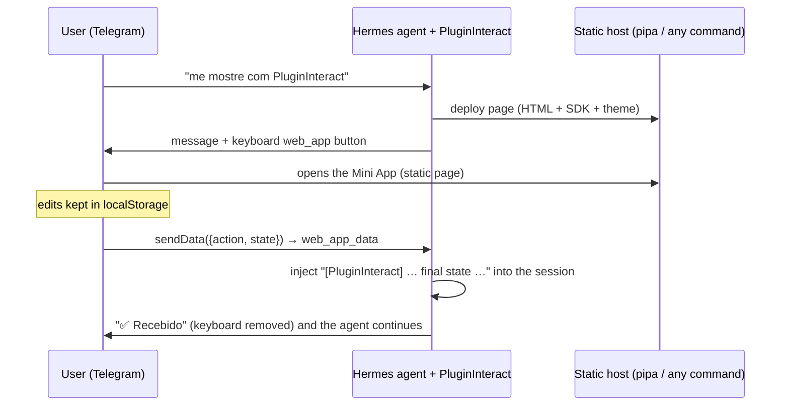

# PluginInteract 🪁

> A [Hermes Agent](https://github.com/NousResearch/hermes-agent) plugin that lets the agent answer with a small
> **interactive page** instead of a wall of text, delivered as a **Telegram Mini App**.

*"quero revisar uma tabela de preços, me mostre com PluginInteract"* → the agent writes a small static page
(editable table, checkboxes, approve / request-changes buttons), deploys it, and the bot sends a keyboard
button. The user opens the page inside Telegram and edits it. Progress is saved in the device's
`localStorage`. When they tap **Aprovar**, the page sends the answer back through the bot, and the agent
continues the same conversation with it.

No server. The page is plain static HTML. The answer travels in a Telegram message:
`Telegram.WebApp.sendData()` sends it, the bot receives it as a `web_app_data` update, and the plugin
injects it into the chat session.



## What's in the box

- **Agent tools** (toolset `interact`): `interact_create`, `interact_update`, `interact_get_state`,
  `interact_close` and `interact_list`, plus a short system-prompt section that tells the agent when to use them.
- **Page SDK** (`window.Interact`), injected into every page. It handles:
  - HTML-attribute bindings: `data-bind`, `data-action`, `data-show-if`, …
  - saving state to `localStorage`;
  - the Telegram theme, haptics and the MainButton;
  - the final `sendData`.
  - Outside Telegram, the submit buttons instead show the payload that would be sent, which helps with testing.
- **Hosting backends:**
  - `pipa` (default): your [pipa](https://github.com/fguisso/pipa) server;
  - `command`: any deploy CLI (wrangler, rsync, `aws s3 cp`…).
- **Telegram hook:** a `web_app_data` handler registered on the gateway's bot. It checks the sender, marks the
  page as answered, injects the result into the conversation and replies "✅ Recebido", which also removes
  the keyboard.
- **Page lifecycle:** each page has a TTL. When a page is closed or expires, it is replaced by a "closed" page.
  A small JSON registry (`~/.hermes/interact/pages.json`) remembers which conversation asked for each page.
- **Commands:** `/interact` in chat, and `hermes interact demo|list|state|close|doctor` in the shell.

## Limits (by design)

- **4096 bytes per answer.** That is Telegram's `sendData` limit. The agent is told to keep `initial_state`
  compact (ids plus editable values) and to put read-only data straight into the HTML. The SDK blocks an
  oversized answer and shows a message.
- **Private chats only.** The page must be opened from the bot's keyboard button: only those Mini Apps can
  call `sendData`, and Telegram allows them only in private chats.
- **One answer per page.** `sendData` closes the Mini App. Reopening a submitted page shows it locked.
- **No partial progress for the agent.** Edits made before submitting stay on the user's device;
  `interact_get_state` only sees what was submitted.

## Install

```bash
hermes plugins install fguisso/hermes-telegram-webapp-interact --enable
# or: git clone https://github.com/fguisso/hermes-telegram-webapp-interact ~/.hermes/plugins/interact
#     hermes plugins enable interact
```

No extra Python dependencies: it uses `python-telegram-bot`, which the Hermes Telegram gateway already has.

## Configure

In `~/.hermes/config.yaml`, use the plugin key shown by `hermes plugins list` (`interact` below):

```yaml
plugins:
  entries:
    interact:
      allow_gateway_injection: true        # REQUIRED: lets the answer re-enter the chat session
      settings:
        backend: pipa                      # pipa | command
        default_ttl_minutes: 1440
        button_text: Abrir
        pipa:
          zone: public                     # needs the server's `zone` feature (else omit, or force_zone: true)
          # workspace: <ws-id>
          # headless: true                 # CI/agents: creds from PIPA_REFRESH_TOKEN / PIPA_SECRET_GET_CMD
          # purge: false                   # interact_close also runs `pipa rm` (human step-up)
        # backend: command
        # command:
        #   deploy: "wrangler pages deploy {dir} --project-name interact --branch {page_id}"
        #   url_template: "https://{page_id}.interact.pages.dev/"
```

Every setting can also be set with an env var: `INTERACT_BACKEND`, `INTERACT_PIPA_ZONE`,
`INTERACT_COMMAND_DEPLOY`, … (see `interact/settings.py`). If your config pins `platform_toolsets` for
Telegram, add `interact` there. Answers are accepted from the user who asked for the page and from anyone in
`TELEGRAM_ALLOWED_USERS`.

Pages must be served over **https**, because Telegram only opens https Mini Apps. Your pipa server behind
Caddy already covers that.

## pipa integration

Log the pipa CLI in once, on the machine that runs the gateway:

```bash
curl -fsSL https://guisso.dev/pipa/install.sh | sh
pipa login --server https://pages.example.com --automation   # automation scope: can deploy, can never delete
```

| Step | Command | Why |
|---|---|---|
| create | `pipa --json deploy <dir> --new --access noauth --csp off [--zone public]` | Telegram can't type a password. pipa's strict CSP (`default-src 'self'`) would block Telegram's WebApp script, so the page ships its own `<meta>` CSP instead. None of these flags needs a step-up at creation time. |
| update | `pipa --json deploy <dir> --uuid <uuid>` | The URL, and so the Telegram button, stays the same. |
| close / expire | `pipa --json deploy <dir> --uuid <uuid>` with a "closed" page | `pipa rm` always requires a human step-up, so the page is overwritten instead. |
| purge (opt-in) | `pipa --json rm <uuid> --no-wait`, then `--resume` in the background | Returns `purge_verify_url` for a human to approve. Needs a non-`--automation` login. |

### Deploying test pages to pipa

```bash
INTERACT_BACKEND=pipa python -m interact demo      # or: hermes interact demo
```

This deploys the demo price-review page and prints its URL. Open it in a browser: edits survive a reload
(`localStorage`), and the submit buttons show the exact payload the bot would receive.

If you don't have a pipa server at hand, `scripts/pipa-local.sh` starts a throwaway local one from a pipa
checkout. It creates an admin and pairs a headless automation CLI. It uses an isolated HOME and a file
vault, so it never touches your keychain.

```bash
PIPA_DIR=~/src/pipa scripts/pipa-local.sh && . .interact-data/pipa/env.sh && python -m interact demo
```

## Writing pages (what the agent sees)

```html
<div class="ix-stack">
  <h1>Tabela de preços</h1>
  <div class="ix-table-wrap"><table class="ix-table">
    <tr><td>Plano Pro</td>
        <td data-bind="rows.0.current" data-format="currency"></td>
        <td><input type="number" step="0.01" data-bind="rows.0.price"></td>
        <td><input type="checkbox" data-bind="rows.0.approved"></td></tr>
  </table></div>
  <textarea data-bind="notes"></textarea>
  <div class="ix-row">
    <button class="ix-btn ix-secondary" data-action="request_changes">Pedir ajustes</button>
    <button class="ix-btn" data-action="approve" data-confirm="Enviar?">Aprovar</button>
  </div>
  <p class="ix-muted" data-interact-status></p>
</div>
```

| Attribute / API | Effect |
|---|---|
| `data-bind="a.b.0"` | Two-way binding on inputs (number → Number, checkbox → bool, several checkboxes sharing a path → array). Display-only on other elements, formatted with `data-format="currency\|number\|percent\|json"`. |
| `data-action="x"` | Sends the state to the bot with action `x` and closes the Mini App. `data-confirm="…"` asks first; `data-extra='{"k":1}'` adds context. |
| `data-set="path" data-value='"v"'` / `data-toggle="path"` | Chips and toggles; `aria-pressed` is managed for you. |
| `data-show-if="path"` / `"path=v"` / `"!path"` | Conditional visibility. |
| `<form data-interact data-action="send">` | Collects named fields into the state on submit. |
| `Interact.get/set/update/onChange/submit/bind/reset` | JavaScript access. Elements added later are bound automatically. |
| `main_button: {text, action}` (tool arg) | Telegram's native bottom button; a sticky fallback is used outside Telegram. |

The agent receives the answer like this:

````text
[PluginInteract] Ana Lima submitted the interactive page "Revisão da tabela de preços" (page_id: 3hK…).
action: approve
final state:
```json
{"rows": [{"product": "Plano Pro", "current": 99.9, "price": 109.9, "approved": true}], "notes": ""}
```
````

## Security model

- Answers reach the bot only as `web_app_data` messages. Telegram creates these from the Mini App the user
  opened through the bot's own keyboard button, and attaches the real sender. The plugin accepts an answer
  only from the user who asked for the page (or from `TELEGRAM_ALLOWED_USERS`), and only once, before the
  page's TTL runs out.
- Page URLs carry a random id. The page makes no network calls: its CSP sets `connect-src 'self'` and
  `form-action 'none'`, and allows scripts only from Telegram and the jsdelivr/cdnjs CDNs.
- Answers re-enter the chat only with `allow_gateway_injection`, and Hermes re-checks the session's
  authorization before injecting.

## Development

```bash
uv run --no-project --with pytest --with python-telegram-bot pytest -q
```

Layout:

- `plugin.yaml` and `__init__.py`: the Hermes entry point, which loads `interact/plugin.py` (`register(ctx)`).
- `interact/service.py`: page lifecycle and `web_app_data` handling.
- `interact/bridge.py`: Telegram.
- `interact/backends.py`: deploy backends.
- `interact/render.py` and `interact/assets/`: rendering, the SDK, the theme and the demo page.
- `interact/tools.py` and `interact/cli.py`: agent tools and commands.
